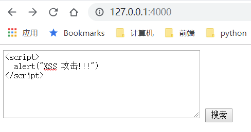
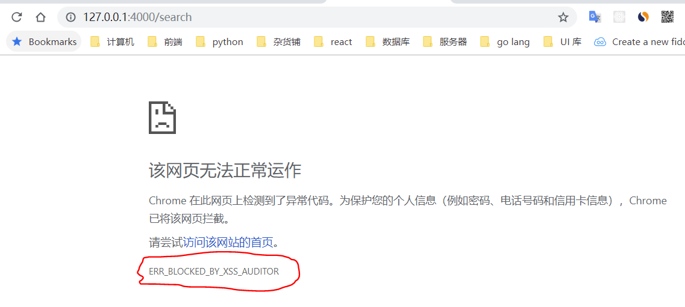
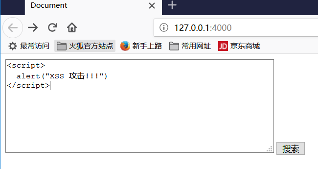
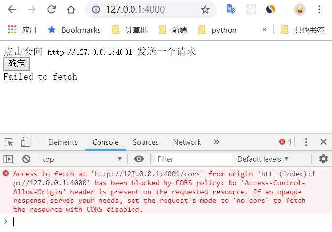
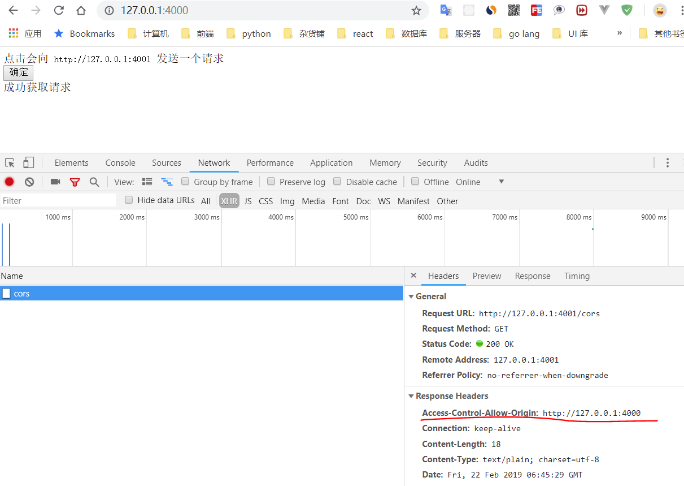
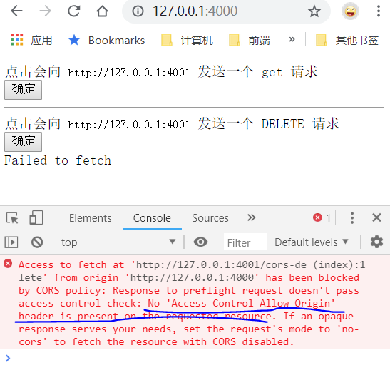

# WEB 安全

## [CSRF](https://zh.wikipedia.org/wiki/%E8%B7%A8%E7%AB%99%E8%AF%B7%E6%B1%82%E4%BC%AA%E9%80%A0)

跨站请求攻击，简单地说，是攻击者通过一些技术手段欺骗用户的浏览器去访问一个自己曾经认证过的网站并运行一些操作（如发邮件，发消息，甚至财产操作如转账和购买商品）。由于浏览器曾经认证过，所以被访问的网站会认为是真正的用户操作而去运行。这利用了web中用户身份验证的一个漏洞：简单的身份验证只能保证请求发自某个用户的浏览器，却不能保证请求本身是用户自愿发出的。

### 验证过程

在 hosts 文件添加两个用于测试的域名, hosts 文件的位置一般在 `C:\Windows\System32\drivers\etc\hosts`.
做完测试后记得删掉, 以免不能正常访问网站.
```
127.0.0.1 csrf-attack.com
127.0.0.1 csrf-be-attacked.com
```

依次执行执行以下命令, 启动两个服务.
```
yarn install
yarn run csrf
```

我们先直接访问攻击站点: `csrf-attack.com:4000`

可以看到, 没有 cookie 发送到被攻击站点.

然后我们访问被攻击站点 `csrf-be-attacked.com:4001/set-token` 来模拟登陆, 将 token 写入浏览器.


这时候我们再去访问 `csrf-attack.com:4000`
可以看到被攻击站点接收到了 cookie 的请求


可以想象, 黑客可以诱骗用户先登陆被攻击网站, 然后再把用户诱骗到自己的站点, 在自己的站点用隐藏的图片, 或者其他能发送请求的标签(link, script)来攻击用户的账户.

## [XSS](https://zh.wikipedia.org/wiki/%E8%B7%A8%E7%B6%B2%E7%AB%99%E6%8C%87%E4%BB%A4%E7%A2%BC)

跨站脚本（英语：Cross-site scripting，通常简称为：XSS）是一种网站应用程序的安全漏洞攻击，是代码注入的一种。它允许恶意用户将代码注入到网页上，其他用户在观看网页时就会受到影响。这类攻击通常包含了HTML以及用户端脚本语言。

XSS攻击通常指的是通过利用网页开发时留下的漏洞，通过巧妙的方法注入恶意指令代码到网页，使用户加载并执行攻击者恶意制造的网页程序。这些恶意网页程序通常是JavaScript，但实际上也可以包括Java，VBScript，ActiveX，Flash或者甚至是普通的HTML。攻击成功后，攻击者可能得到更高的权限（如执行一些操作）、私密网页内容、会话和cookie等各种内容。

XSS 攻击一般分为两类:
* Reflected XSS（反射型的 XSS 攻击）
* Stored XSS（存储型的 XSS 攻击）

### Reflected XSS
主要是由于服务端接收到客户端不安全的输入, 在客户端执行了攻击代码.  
启动服务, 相关演示: 
```
yarn run xss
```
在输入框内输入一些 JS 脚本, 然后点击搜索  



Chrome 的安全措施做的不错, 带有危险脚本的页面被拦截下来了: 


我们换成 Firefox 试试:   
   
 

Firefox 成功中招.

### Stored XSS  
基于存储的 XSS 攻击，是通过提交带有恶意脚本的内容存储在服务器上，当其他人看到这些内容时发起 Web 攻击。一般提交的内容都是通过一些富文本编辑器编辑的，很容易插入危险代码。 

存储型攻击, Chrome 没有防住.


从上面的实验可以看出, 对于表单提交的 XSS, Chrome 可以防御住. 
但是对于存储型, Chrome 也没办法.

防御 XSS 的方式, 主要是把特殊字符给转义掉. 比如 `<script></script>` 中的 `<` 和 `>` 分别转义成 `&lt;` 和 `&gt;`. 这个工作, 一般 web 框架和模板引擎都会提供方法. 比如, 这个 koa, 我用的是 ejs 模板引擎, 为了演示, 插入代码的时候用的 `<%- keyword %>`, 实际项目里大多数时候用的是 `<%= keyword %>`, ejs 会帮助我们完成替换特殊字符的工作.

## [CORS](https://developer.mozilla.org/zh-CN/docs/Web/HTTP/Access_control_CORS)

### 跨域
当一个资源从与该资源本身所在的服务器不同的域、协议或端口请求一个资源时，资源会发起一个跨域 HTTP 请求。  
处于安全的考虑, 浏览器会限制脚本的跨域请求. 比如 XHR, fetch 要遵循[同源策略](https://developer.mozilla.org/zh-CN/docs/Web/Security/Same-origin_policy). 

如果不加以限制, 从上面的 XSS, CSRF 攻击可以看到, hacker 可以通过诱骗用户访问伪造的网站, 诱导用户做出一些危险的操作.

但是如果, `www.a.com` 对于 `www.b.com` 来说是可信的站点, `www.a.com` 如何通过 AJAX 向 `www.b.com` 发起请求, 就是CORS(跨域资源共享)机制.   
它使用额外的 HTTP 头来告诉浏览器  让运行在一个 origin (domain) 上的Web应用被准许访问来自不同源服务器上的指定的资源。 以下是跟 CORS 有关的请求头:   

```
Access-Control-Allow-Origin
指示请求的资源能共享给哪些域。

Access-Control-Allow-Credentials
指示当请求的凭证标记为 true 时，是否响应该请求。

Access-Control-Allow-Headers
用在对预请求的响应中，指示实际的请求中可以使用哪些 HTTP 头。

Access-Control-Allow-Methods
指定对预请求的响应中，哪些 HTTP 方法允许访问请求的资源。

Access-Control-Expose-Headers
指示哪些 HTTP 头的名称能在响应中列出。

Access-Control-Max-Age
指示预请求的结果能被缓存多久。

Access-Control-Request-Headers
用于发起一个预请求，告知服务器正式请求会使用那些 HTTP 头。

Access-Control-Request-Method
用于发起一个预请求，告知服务器正式请求会使用哪一种 HTTP 请求方法。

Origin
指示获取资源的请求是从什么域发起的。
```

### CORS 演示

```bash
yarn run cors # 启动服务
```

#### 简单请求

响应中没有 CORS: 

想让请求能正常收发, 我们需要在响应中添加 `Access-Control-Allow-Origin` 响应头, 告诉浏览器, 允许这个域访问该资源.

```javascript
ctx.set('Access-Control-Allow-Origin', 'http://127.0.0.1:4000');
```


请求可以正常收发了.

### 预检请求

对于上面的[简单请求](https://developer.mozilla.org/zh-CN/docs/Web/HTTP/Access_control_CORS#%E7%AE%80%E5%8D%95%E8%AF%B7%E6%B1%82)只需要设置 `Access-Control-Allow-Origin` 就够了. 下面我们来试试一下发送 DELETE 请求

```js
// 给 delete 加上允许跨域源的响应头
router.delete('/cors-delete', async (ctx) => {
  ctx.set('Access-Control-Allow-Origin', 'http://127.0.0.1:4000');
  ctx.body = '成功执行了 DELETE 请求';
});
```


请求失败了, 告诉我们没有设置允许跨域源的响应头, 我们明明已经设置了. 打开 NetWork 面板


看到我们的 `DELETE` 请求变成了一个 `OPTIONS` 请求.
这是因为[非简单请求](https://developer.mozilla.org/zh-CN/docs/Web/HTTP/Access_control_CORS#%E9%A2%84%E6%A3%80%E8%AF%B7%E6%B1%82), 浏览器会先发出一个 `OPTIONS` 请求, 询问服务器, 这个请求是否允许跨域, 接受什么请求方法. 如果实际的请求满足 `OPTIONS` 的响应, 才会把实际请求发出.

```js
// 需要加一个 OPTIONS 的响应
router.options('/cors-delete', async (ctx) => {
  ctx.set('Access-Control-Allow-Origin', 'http://127.0.0.1:4000');
  ctx.set('Access-Control-Allow-Methods', 'DELETE, OPTIONS');
  ctx.body = null;
});
```

### [附带身份凭证的请求](https://developer.mozilla.org/zh-CN/docs/Web/HTTP/Access_control_CORS#%E9%99%84%E5%B8%A6%E8%BA%AB%E4%BB%BD%E5%87%AD%E8%AF%81%E7%9A%84%E8%AF%B7%E6%B1%82)

默认情况下, fetch 和 XMLHttpRequest 在跨域的时候都不会发送 cookie.  
XMLHttpRequest 需要设置 `withCredentials: true`.
```js
const xhr = new XMLHttpRequest();
xhr.open('GET', 'http://example.com/', true);
xhr.withCredentials = true;
xhr.send(null);
```
fetch 需要在配置里加上: `credentials: 'include'`
```js
fetch('/example', {
  method: 'GET',
  credentials: 'include'
})
```

服务端响应中要加上 `Access-Control-Allow-Credentials: true` 告知浏览器允许获取带身份凭证请求的响应.
而 `Access-Control-Allow-Origin` 不能设置为通配符, 必须明确指出是允许哪个地址允许跨域.
```
Access-Control-Allow-Credentials: true
Access-Control-Allow-Origin: www.example.com
```

### [CORS settings attributes](https://developer.mozilla.org/zh-CN/docs/Web/HTML/CORS_settings_attributes )
在HTML5中，一些 HTML 元素提供了对 CORS 的支持, 例如 `img`, `video`, `script`.均有一个跨域属性 (crossOrigin property)，它允许你配置元素获取数据的 CORS 请求。 这些属性是枚举的，并具有以下可能的值：

| 关键字 | 描述 |
|--------|-----|
|anonymous | 对此元素的CORS请求将不设置凭据标志。|
|use-credentials | 对此元素的CORS请求将设置凭证标志; 这意味着请求将提供凭据。 |

示例: 
```html
<script src="https://example.com/example-framework.js"
        crossorigin="anonymous"></script>
```

参考资料:  
https://www.w3.org/TR/cors/#user-credentials  
https://developer.mozilla.org/zh-CN/docs/Glossary/CORS  
https://developer.mozilla.org/zh-CN/docs/Web/HTTP/Access_control_CORS  
https://developer.mozilla.org/zh-CN/docs/Web/Security/Same-origin_policy  
https://developer.mozilla.org/zh-CN/docs/Web/HTML/CORS_settings_attributes  